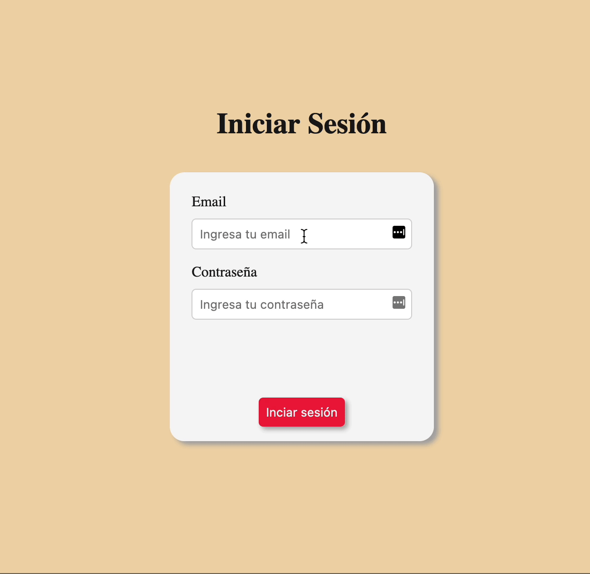

# Ejercicio de Práctica. ✏️

En el presente ejercicio, partiremos de un formulario de login previamente implementado, en donde la persona debera ingresar su email y contraseña.

La consigna del ejercicio, consiste en simular una validación asincrónica, la que en la vida real se realizaría comparando la información ingresada por la persona, contra los datos que se encuentran almacenados en el servidor.

Para ello, simularemos un tiempo de respuesta (hasta que se resuelva la peticion al servidor), de tres segundos. Durante dicho lapso, deberemos indicar al usuario que la aplicacion se encuentra "Iniciando Sesión".

Asimismo, a partir de los datos ingresados, validaremos si los mismos cumplen con ciertos requisitos pre-establecidos y, además, si coinciden con la información del usuario almacenada en la base de datos. En caso de que los mismos no coincidan, deberemos mostrar un mensaje de error.

Si los datos ingresados son correctos, se deberá mostrar un mensaje de bienvenida la persona.

Para resolver esta actividad, deberás examinar y prestar atención a los distintos tags html y sus distintas propiedades, para ver de que manera puedes seleccionar y manipular cada elemento mediante javascript. De la misma manera, en el archivo styles.css, te dejamos algunos estilos que podrán serte de utilidad para realizar la tarea asignada. 👀 👀 👀

## Ejemplo:

Puedes ver el comportamiento del formulario en la siguiente imagen:

A programar! 💻
